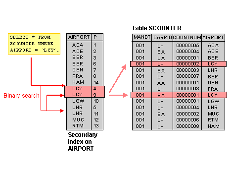

# 데이터베이스
---
## 데이터 베이스를 사용하는 이유

데이터베이스가 존재하기 이전에는 파일 시스템을 이용하여 데이터를 관리했다. 데이터를 각각 파일 단위로 저장하며 이러한 일들을 처리하기 위한 독립적인 애플리케이션과 상호 연동되어야 한다. 이 때 발생할 수 있는 문제점이 데이터의 종속성, 중복성, 무결성이다.

### 데이터 베이스 특징
1. 데이터의 독립성
    - 물리적 독립성: 데이터베이스 사이즈를 늘리거나 성능 향상을 위해 데이터 파일을 늘러거나 새롭게 추가하더라도 관련된 응용 프로그램을 수정할 필요 없다.
    - 논리적 독립성: 데이터베이스는 논리적인 구조로 다양한 응용 프로그램의 논리적 요구를 만족시켜줄 수 있다.

2. 데이터의 무결성
   - 데이터의 무결성은 데이터의 정확성과 일관성을 유지하고 보증하는 것을 가리킨다.
   - 여러 경로를 통해 잘못된 데이터가 발생하는 경우의 수를 방지하는 기능으로 데이터의 유효성 검사를 통해 데이터의 무결성을 구현하게된다.

3. 데이터의 보안성
   - 인가된 사용자들만 데이터베이스나 데이터베이스 내의 자원에 접근할 수 있도록 계정 관리 또는 접근 권한을 설정함으로써 모든 데이터에 보안을 구현할 수 있다
  
4. 데이터의 일관성
    - 연관된 정보를 논리적인 구조로 관리함으로써 어떤 하나의 데이터만 변경했을 경우 발생할 수 있는 데이터의 불일치성을 배제할 수 있다. 또한 작접 중 일부 데이터만 변경되어 나머지 데이터와 일치하지 않는 경우의 수르 배제할 수 있다.

5. 데이터의 중복 최소화
   - 데이터베이스는 데이터를 통합해서 관리함으로써 파일 시스템의 단점 중 하나인 자료 중복과 데이터 중복성 문제를 해결할 수 있다.

## 데이터베이스의 성능에 관하여
데이터베이스의 성능 이슈는 디스크 I/O를 어떻게 줄이느냐에서 시작된다. 디스크 I/O는 디스크 드라이브의 플래터를 돌려서, 읽어야 할 데이터가 저장된 위치로 디스크 헤더를 이동 시켜 다음 데이터를 읽는 것을 의미한다. 이 때 데이터를 읽는데 걸리는 시간은 디스크 헤더를 움직여서 읽고 쓸 위치로 옮기는 단계에서 결정된다. 

따라서 순차 I/O가 랜덤 I/O보다 빠를 수 밖에 없다. 하지만 현실은 대부분이 랜덤 I/O이다. 랜덤 I/O를 순차 I/O로 바꿔서 실행할 수 없을까라는 생각이 데이터베이스 쿼리 튜닝의 시작이다.

# Index
----
## Index란
인덱스는 색인이다. 색인은 책의 내용을 빠르게 찾아볼 수 있도록한다. 데이터베이스에서 색인은 테이블에 저장된 모든 데이터를 검색하여 원하는 결과를 찾아내는 것이 아니라, 특정 컬럼의 값과 해당 레코드가 저장된 주소를 키와 값의 쌍으로 인덱스르 만들어 두는 기술이다.

DBMS의 인덱스는 항상 정렬된 상태를 유지하므로 원하는 값을 빠르게 탐색할 수 있다. 하지만 데이터를 삽입, 삭제, 수정하는 것처럼 테이블에 변화를 주는 경우 인덱스를 정렬된 상태로 유지해야하기 때문에 실행속도가 느려진다.

인덱스를 관리하기 위해서는 추가적인 자원이 필요하다. 인덱스가 따로 테이블의 형태로 관리되기 때문이다. 따라서 무분별한 인덱스 사용은 오히려 성능 저하를 야기할 수 있다.

<p align=middle>
    
</p>

## Index의 자료구조
### B+-Tree 
일반적으로 사용되는 인덱스 알고리즘은 B+-Tree 알고리즘이다. B+-Tree 인덱스는 컬럼의 값을 변형하지 않고(사실 값의 앞 부분만 잘라서 관리한다), 원래의 값을 이용해 인덱싱하는 알고리즘이다.

### Hash 인덱스 알고리즘
컬럼의 값으로 해시 값을 계산해서 인덱싱하는 알고리즘으로 O(1) 시간에 탐색가능하다. 하지만 값을 변형해서 인덱싱 하므로, 특정 문자로 시작하는 값으로 검색을하는 전방 일치와 같이 값의 일부만으로 검색하고자 할 때는 해시 인덱스를 사용할 수 없다. 주로 메모리 기반의 데이터베이스에서 많이 사용한다.

### B+-Tree를 사용하는 이유
SELECT의 질의 조건에는 부등호가 포함된다. Hash Table을 사용하면 등호 연산은 제공되나 부등호 연산은 제공되지 않는다.


## DML이 일어났을 때 상황
1. INSERT

기존 블럭에 여유가 없을 때 새로운 데이터가 입력된다. 새로운 블럭을 할당 받은 후 키를 옮기는 작업을 수행한다. 이때 많은 양의 REDO가 기록된다. INDEX Split 작업 동안 해당 블럭의 키 값에 대해서 DML이 블로킹되고 대기 이벤트가 발생한다.

2. DELETE

테이블에서 데이터가 삭제되는 경우에는 데이터가 지워지고 다른 데이터가 그 공간을 사용한다. 

인덱스에서 데이터가 삭제되는 경우 데이터가 지워지지 않고 사용하지 않음 표시만 해둔다. 따라서 테이블과 인덱스의 데이터 수가 다를 수 있다.

3. UPDATE

테이블에서 UPDATE가 발생해도 인덱스는 UPDATE할 수 없다. 따라서 인덱스에서는 DELETE가 발생한 수 새로운 INSERT 작업이 수행된다. 따라서 작업이 2배가 더 발생한다.

### Index에서 고려 사항

앞에서 살펴보았듯이 인덱스를 사용한다고 해서 모든 상황에서 데이터베이스의 성능 향상이 이루어지는 것은 아니다.

DML이 이루어지는 상황뿐 아니라 인덱스 컬럼을 이루고 있는 데티어의 형식에 따라서 성능에 영향을 미칠 수 있다. 만약 이름, 성별, 나이라는 컬럼이 있을 경우 성별과 나이는 데이터가 중복될 가능성이 높다. 반면에 이름은 두 컬럼보다는 중복될 가능성이 낮다. 

# 정규화
---
## 왜 정규화인가?
한 릴레이션에 여러 엔티티의 애트리뷰트를 혼합하게 되면 데이터가 중복 저장되며, 저장공간을 낭비하게 된다. 이로 인해 여러가지 `이상 현상(Anomaly)`이 발생한다. 이상 현상의 종류는 다음과 같다.

1. 삽입 이상
  - 데이터를 삽입할 때 불필요한 데이터까지 함께 삽입되는 현상
  - 기본키가 (student_id, course_id)인 경우 수업을 수강하지 않는 학생은 course_id가 없는 현상이 발생한다. 기본키는 NULL이 될 수 없으므로 course_id에 의미 없는 데이터를 추가해야 기본키로 설정할 수 있다. 

2. 삭제 이상
   - 하나의 데이터만 삭제하고 싶을 때, 그 데이터가 포함된 튜플 전체가 삭제되어 원하지 않는 정보 손실이 발생하는 것이다.
   - 어떤 학생이 수강을 철회하는 경우 (student_id, course_id, department, grade) 중 필요한 데이터인 student_id, course_id도 함께 삭제되는 경우

3. 갱신 이상
   - 정확하지 않거나 일부의 튜플만 갱신되어 모호해지거나 일관성이 없어져 정확한 정보 파악이 되지 않는 문제점을 말한다.
   - 한 학생이 전과한 경우(student_id, course_id, department, grade) 에서 department를 일부만 수정하는 일이 발생할 수 있다.

## 정규화란?
관계형 데이터베이스에서 중복을 최소화하기 위해 데이터를 구조화하는 작업이다. 좀 더 구체적으로 불만족스러운 나쁜 릴레이션의 애트리뷰트들을 나누어서 좋은 작은 릴레이션으로 분해하는 작업을 의미한다. 

정규형이란 특정 조건을 만족하는 릴레이션의 스키마 형태를 말하며 제 1정규형, 제 2정규형, 제 3정규형 등이 존재한다.

### 나쁜 릴레이션?
엔티티를 구성하고 있는 애트리뷰트간 함수적 종속성을 판단한다. 판단된 함수적 종속성은 좋은 릴레이션 설계의 전형적 기준으로 사용된다.

### 함수적 종속성?
함수적 종속성이란 애트리뷰트 데이터들의 의미와 애트리뷰트간의 상효 관계로부터 유도되는 제약조건의 일종이다. 

X와 Y를 임의의 애트리뷰트 집합이라고 할 때, X의 값이 Y의 값을 유일하게 결정한다면, **"X는 Y를 함수적으로 결정한다"**라고한다.

### 제 1 정규형
애트리뷰트의 도메인이 오직 원자값만을 포함하고, 튜플의 모든 애트리뷰트가 도메인이 속하는 하나의 값을 가져야 한다(취미: 농구, 축구 X). 즉, 복합 애트리뷰트, 다중값 애트뷰트, 중첩 릴레이션 등 비 원자적인 애트리뷰트를 허용하지 않는 릴레이션이다.

### 제 2 정규형
모든 비주요 애트리뷰트들이 주요 애트리뷰트에 대해서 완전 함수적 종속이면 제 2 정규형을 만족한다고 볼 수 있다. 

완전 함수적 종속이란 X -> Y라고 가정했을 때, X의 어떠한 애트리뷰트라도 제거하면 더 이상 함수적 종속성이 성립하지 않는 경우를 말한다. 즉, 키가 아닌 열들이 각각 후보키에 대해 결정되는 릴레이션 형태를 말한다.

(A, B)가 키일 때 (A), (B)가 각각 키가 될 수 없다는 말이다.

### 제 3 정규형
어떠한 비주요 애트리뷰트도 기본키에 대해서 이행적으로 종속되지 않으면 제 3 정규형을 만족한다고 볼 수 있다. 

이행 함수적 종속이란 X -> Y, Y -> Z의 경우에서 추론될 수 있는 X -> Z의 종속 관계를 말한다. 즉, 비주요 애트리뷰트가 비주요 애트리뷰트에 의해 종속되는 경우가 없는 릴레이션을 말한다.

### BNCF(Boyce-Codd) 정규형
여러 후보 키가 존재하는 릴레이션에 해당하는 정규화 내용이다. 복잡한 식별자 관계에 의해 발생하는 문제를 해결하기 위해 제 3 정규형을 보완하는 데 의미가 있다. 비주요 애트리뷰트가 후보키의 일부를 결정할 때 분해하는 과정을 말한다.

### 정규화의 장점

- 데이터베이스 변경 시 이상 현상과 같은 문제점을 해결할 수 있다
- 데이터베이스 구조 확장 시 재 디자인을 최소화할 수 있다. 정규화된 데이터베이스 구조에서는 새로운 데이터 형의 추가로 인한 확장 시 그 구조 변경을 하지 않아도 되거나 일부만 변경해도 된다.
- 사용자에게 데이터 모델을 더욱 의미있게 제공한다. 정규화된 테이블들간 관계들은 현실 세계에서의 개념들과 그들간의 관계들을 반영한다.

### 정규화의 단점
- 릴레이션 분해로 인한 조인 연산이 많아진다.
  - 정규화를 통해 중복된 데이터를 제거하여 속도가 빨라질 수 있지만 조인 연산으로 인해 연산이 오히려 느려질 수도 있다.


# Transaction
---

## 트랜잭션(Transaction)?
트랜잭션은 작업의 완전성을 보장해주는 것이다. 즉 논리적인 작업 셋을 모두 완벽하게 처리하거나 또는 처리하지 못할 경우에는 원 상태로 복구해서 작업의 일부만 적용되는 현상을 발생하지 않게 해주는 기술이다. 사용자 입장에서는 하나의 논리적인 작업 단위로 인식할 수 있고, 시스템 입장에서는 데이터들을 접근 또는 변경하는 프로그램 단위가된다.

## 트랜잭션과 Lock
잠금(Lock)과 트랜잭션은 서로 비슷한 개념 같지만, 잠근은 동시성을 제어하기 위한 기능이고 트랜잭션은 데이터의 정합성을 보장하기 위한 기능이다. 잠금은 여러 커넥션에서 동시에 동일한 자원(레코드, 테이블)을 요청할 경우 순서대로 한 시점에는 하나의 커넥션만 변경할 수 있게 해주는 역할을 한다. 이와 달리 트랜잭션은 꼭 여러개의 변경 작업을 수행하는 쿼리가 조합되었을 때만 의미 있는 것은 아니다. 트랜잭션은 논리적인 작업 셋에 쿼리가 몇개가 있든 작업 셋 전체가 성공하거나 그렇지 않을 경우 아무것도 적용되지 않아야함을 보장하는 것이다. 

## 트랜잭션의 특성 - ACID

### 원자성(Atomicity)
만약 트랜잭션 중간에 어떠한 문제가 발생한다면 트랜잭션에 해당하는 어떠한 작업 내용도 수행되어서는 안되며 아무런 문제가 발생되지 않을 경우에먼 모든 작업이 수행되어야 한다.

### 일관성(Consistency)
트랜잭션이 완료된 다음의 상태에서도 트랜잭션이 일어나기 전의 상황과 동일하게 데이터의 일관성을 보장해야한다.

### 고립성(Isolation)
각각의 트랜잭션은 서로 간섭없이 독립적으로 수행 되어야 한다.

### 지속성(Durability)
트랜잭션이 정상적으로 종료된 다음에는 영구적으로 데이터베이스에 작업의 결과가 저장되어야 한다.

## 트랜잭션의 상태
<p align=middle>
    
</p>

- Active
  - 트랜잭션의 활동 상태. 트랜잭션이 실행 중이며 동작중인 상태를 말한다
- Failed
  - 트랜잭션 실패 상태. 트랜잭션이 더이상 정상적으로 진행할 수 없는 상태를 말한다
- Partially Committed
  - 트랜잭션의 Commit 명령이 도착한 상태. 트랜잭션의 commit 이전 sql 문이 수행되고 commit만 남은 상태
- Aborted
  - 트랜잭션이 취소된 상태. 트랜잭션이 취소되고 트랜잭션 실행 이전 데이터로 돌아간 상태를 말한다

### 트랜잭션 사용 유의 사항
트랜잭션의 범위는 최소화해야 한다. 일반적으로 데이터베이스 커넥션의 개수는 제한적이다. 그런데 각 단위 프로그램이 커넥션을 소유하는 시간이 길어진다면 사용 가능한 여유 커넥션의 개수는 줄어들게 된다. 그러다가 어느 순간에 각 단위 프로그램에서 커넥션을 가져가기 위해 기다려야 하는 상황이 발생할 수도 있다.


## 트랜잭션 격리 수준(Isolation Level)

### 격리 수준의 필요성
데이터베이스는 ACID와 같은 특성으로 트랜잭션이 독립적으로 수행될 수 있도록 한다. 이를 위해 DB는 Locking을 사용하여 한 트랜잭션이 데이터베이스를 사용하는 동안 다른 트랜잭션이 관여하지 못하도록 제한한다.

하지만 무조건적으로 Lock을 사용하면 수 많은 트랜잭션들을 순서대로 처리하게 되어 데이터베이스의 성능이 저하된다. 그렇다고 Locking의 범위를 필요 이상으로 줄인다면 더 큰 문제가 발생할 것이다. 따라서 최대한 효율적으로 데이터베이스가 동작하도록 Lock의 범위를 최소화해야한다.

### 격리 수준
1. Level 0: Read Uncommitted
   - SELECT 문장이 수행되는 동안 해당 데이터에 Shared Lock이 걸리지 않는다.
트랜잭션이 처리중이거나 아직 Commit되지 않은 데이터를 다른 트랜잭션이 읽는 것을 허용한다.

```md
예시
1. A 트랜잭션에서 10번 학생의 학년을 2학년에서 3학년으로 변경
2. 아직 커밋하지 않음
3. B 트랜잭션에서 10번 학생의 학년을 조회한다
4. 3학년으로 조회된다.
   - Dirty Read
5. A 트랜잭션에서 문제가 발생하여 트랜잭션이 실패했다
6. B 트랜잭션은 10번 학생이 3학년이라고 생각하고 로직을 수행한다.
```

2. Level 1: Read Committed
   - SELECT 문장이 수행되는 동안 해당 데이터에 Shared Lock이 걸린다.
트랜잭션이 수행되는 동안 다른 트랜잭션이 접근할 수 없어 대기하게 된다. Commit이 이루어진 트랜잭션만 조회가 가능하다.

데이터 정합성 문제가 해결된 듯 보이지만 Non-Repeatable Read 부정합 문제가 발생할 수 있다.

```md
예시
1. B 트랜잭션에서 10번 학생의 학년을 조회한다
2. 2학년이 조회된다
3. A 트랜잭션이 10번 학생을 3학년으로 변경한다
4. B 트랜잭션에서 10번 학생의 학년을 다시 조회한다
5. 3학년으로 조회된다.
```

이는 하나의 트랜잭션에서 똑같은 SELECT를 수행했을 경우 항상 같은 결과를 반환해야 한다는 Repeatable Read 정합성에 어긋나는 결과이다.

3. Level 2: Repeatable Read
   - 트랜잭션이 완료될 때까지 SELECT 문장이 사용하는 모든 데이터에 Shared Lock이 걸린다. 

트랜잭션이 범위 내에서 조회한 데이터 내용이 항상 동일함을 보장한다. 다른 사용자는 트랜잭션 영역에 해당되는 데이터에 대한 수정이 불가능하다.

즉, 트랜잭션이 시작되기 전에 커밋된 내용에 대해서만 조회가 가능한 격리 수준이다.


4. Level 3: Serializable

   - 트랜잭션이 완료될 때까지 SELECT 문장이 사용하는 모든 데이터에 Shared Lock이 걸린다.

완벽한 읽기 일관성을 제공한다. 다른 사용자는 트랜잭션 영역에 해당되는 데이터에 대한 수정 및 입력이 불가능하다.


참고: https://joont92.github.io/db/%ED%8A%B8%EB%9E%9C%EC%9E%AD%EC%85%98-%EA%B2%A9%EB%A6%AC-%EC%88%98%EC%A4%80-isolation-level/