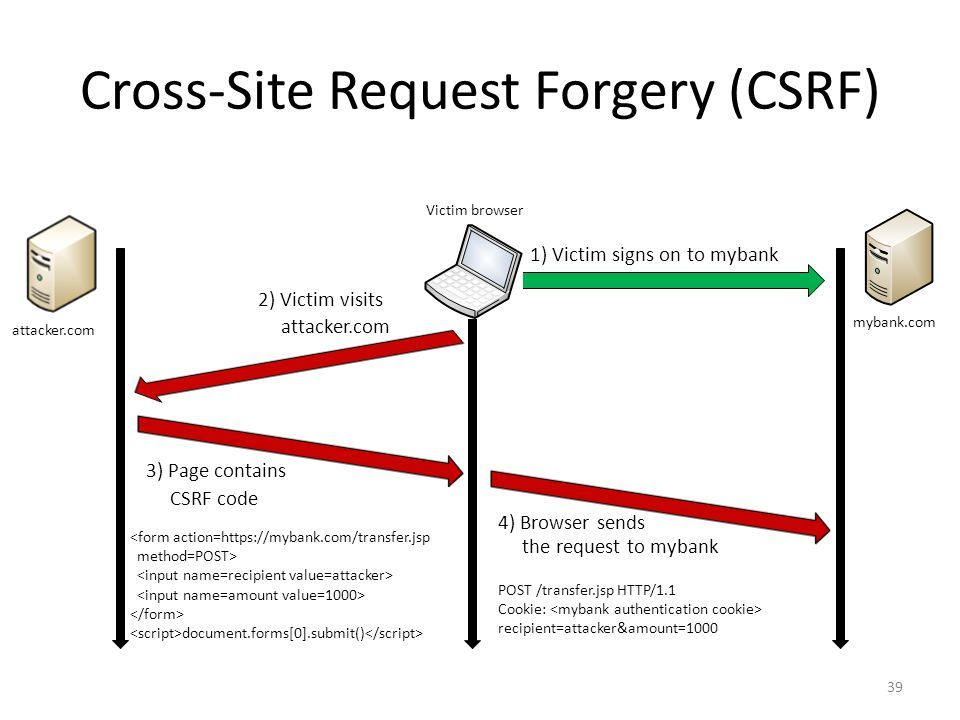
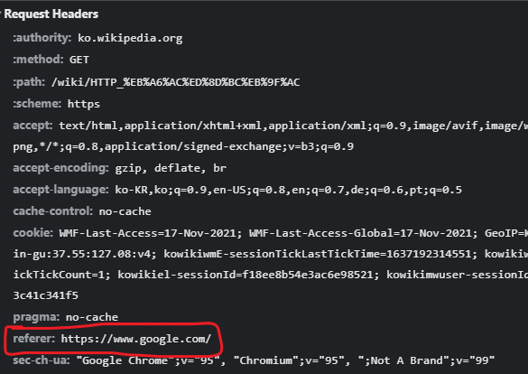
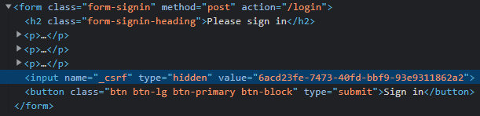

# Cross-Site Request Forgery(CSRF)
---
CSRF 인터넷 사용자가 자신의 의지와는 무관하게 공격자가 의도한 행위를 특정 웹사이트에 요청하게 만드는 공격이다.

CSRF를 통해 악의적인 공격자는 사요자의 권한을 도용하여 중요한 기능을 실행하는 것이 가능해진다. CSRF 공격이 이루어지려면 다음 2가지 조건을 만족해야한다.

- 위조 요청을 전송하는 서비스에 사용자가 로그인 상태
- 사용자가 해커가 만든 피싱 사이트에 접속

CSRF가 이루어지는 시나리오를 그림으로 나타내면 아래와 같다.

<p align=middle>
    
</p>

1. 사용자가 mybank.com에 로그인한다
2. 사용자가 피싱 사이트인 attacker.com에 접속한다
3. attacker.com에는 mybank.com에 계좌 이체를 요청하는 Form이 숨겨져있다.
4. 사용자가 Form을 submit하면 mybank.com에서 계좌 이체 요청이 전달된다.

## 방어 방법
### Referrer 검증
referrer를 확인하여 domain이 일치하는 지 검증하는 방법이다. 일반적으로 referrer 검증만으로 대부분의 CSRF 공격을 방어할 수 있다. 하지만 같은 도메인 내의 페이지에 XSS 취약점이 있는 경우 CSRF 공격에 취약해질 수 있다. domain 단위 검증에서 좀 더 세밀하게 페이지 단위까지 일치하는지 검증하면 도메인 내의 타 페이지에서 XSS 취약점에 의한 CSRF 공격을 방어할 수 있다.

**Referrer?**
HTTP 리퍼러(HTTP referer)는 웹 브라우저로 월드 와이드 웹을 서핑할 때, 하이퍼링크를 통해서 각각의 사이트로 방문시 남는 흔적을 말한다.
<p align=middle>
    
</p>

**XSS?**

XSS(Cross-Site Scripting)이란 웹 애플리케이션에서 일어나는 취약점으로 관리자가 아닌 권한이 없는 사용자가 웹 사이트에 스크립트를 삽입하는 공격방법이다. 

자세한 내용은 [여기](https://noirstar.tistory.com/266)참고.


### CSRF Token 사용

사용자의 세션에 임의의 토큰 값을 저장하고 사용자의 요청 마다 해당 토큰 값을 포함 시켜 전송한다. 리소스를 변경해야 하는 요청을 받을 때마다 사용자의 세션에 저장된 토큰 값과 요청 파라미터에 전달되는 토큰 값이 일치하는 지 검증하는 방법이다.

<p align=middle>
    
</p>

# CsrfFilter
---

CSRF 공격에 대한 방어를 담당하는 필터이다.

```java
@Override
	protected void doFilterInternal(HttpServletRequest request, HttpServletResponse response, FilterChain filterChain)
			throws ServletException, IOException {
		request.setAttribute(HttpServletResponse.class.getName(), response);
		CsrfToken csrfToken = this.tokenRepository.loadToken(request); // 1
		boolean missingToken = (csrfToken == null);
		if (missingToken) {
			csrfToken = this.tokenRepository.generateToken(request);
			this.tokenRepository.saveToken(csrfToken, request, response);
		}
		request.setAttribute(CsrfToken.class.getName(), csrfToken);
		request.setAttribute(csrfToken.getParameterName(), csrfToken);
		if (!this.requireCsrfProtectionMatcher.matches(request)) { // 2
			if (this.logger.isTraceEnabled()) {
				this.logger.trace("Did not protect against CSRF since request did not match "
						+ this.requireCsrfProtectionMatcher);
			}
			filterChain.doFilter(request, response);
			return;
		}
		String actualToken = request.getHeader(csrfToken.getHeaderName()); // 3
		if (actualToken == null) {
			actualToken = request.getParameter(csrfToken.getParameterName());
		}
		if (!equalsConstantTime(csrfToken.getToken(), actualToken)) { // 4
			this.logger.debug(
					LogMessage.of(() -> "Invalid CSRF token found for " + UrlUtils.buildFullRequestUrl(request)));
			AccessDeniedException exception = (!missingToken) ? new InvalidCsrfTokenException(csrfToken, actualToken)
					: new MissingCsrfTokenException(actualToken);
			this.accessDeniedHandler.handle(request, response, exception);
			return;
		}
		filterChain.doFilter(request, response);
	}
```

1. `HttpServletRequest`를 기반으로 `CsrfTokenRepository`에서 서버에 저장된 CSRF 토큰을 가져온다.
2. 읽기 전용 HTTP 요청(GET, HEAD, OPTIONS, TRACE)은 CSRF 방어 대상에서 제외한다.
3. 클라이언트에서 전송한 CSRF 토큰을 가져온다
4. 서버의 토큰과 클라이언트가 전송한 토큰을 비교한다.
 - 같지 않을 경우 `AccessDeniedException`을 던진다.

## HttpSessionCsrfTokenRepository

세션에 CsrfToken을 저장하고 로드한다.

```java
@Override
public void saveToken(CsrfToken token, HttpServletRequest request, HttpServletResponse response) {
    if (token == null) {
        HttpSession session = request.getSession(false);
        if (session != null) {
            session.removeAttribute(this.sessionAttributeName);
        }
    }
    else {
        HttpSession session = request.getSession();
        session.setAttribute(this.sessionAttributeName, token);
    }
}

@Override
public CsrfToken loadToken(HttpServletRequest request) {
    HttpSession session = request.getSession(false);
    if (session == null) {
        return null;
    }
    return (CsrfToken) session.getAttribute(this.sessionAttributeName);
}
```

---
참고
- https://itstory.tk/entry/CSRF-%EA%B3%B5%EA%B2%A9%EC%9D%B4%EB%9E%80-%EA%B7%B8%EB%A6%AC%EA%B3%A0-CSRF-%EB%B0%A9%EC%96%B4-%EB%B0%A9%EB%B2%95