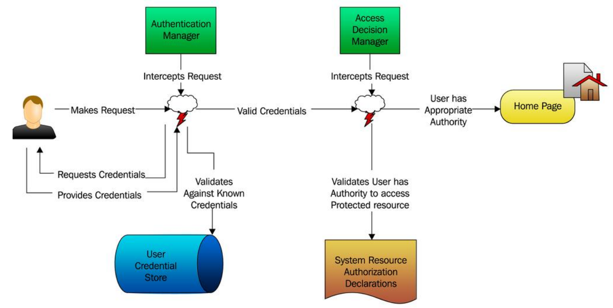
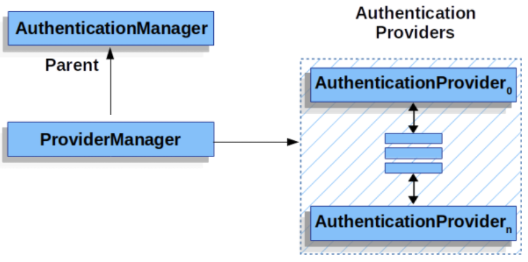

# Spring Security Architecture
---

## Filters
---
Spring Security는 서블릿 필터를 기반으로 구현되어있다. 아래 그림은 HTTP 요청에 대해 처리하기 위한 서블릿의 일반적인 계층 구조를 나타낸다.

<p align=middle>
    
</p>

Spring MVC에서 Servlet은 `DispatcherServlet`의 인스턴스이며, 최대 하나의 서블릿이 단일 HttpServletRequest 또는 HttpServletResponse을 처리할 수 있다.

하나 이상의 Filter 들은 다음과 같이 사용된다.
- Downstream의 Filter나 Servlet이 호출되지 않도록 막는다. 이 경우, Filter는 일반적으로 HttpServletResponse를 작성한다.

- Downstream의 Filter나 Servlet이 사용할 HttpServletRequest나 HttpServletResponse를 수정한다.

### DelegatingFilterProxy
Spring은 Filter의 구현체로 `DelegatingFilterProxy`를 제공한다.
`DelegatingFilterProxy`는 서블릿 컨테이너와 스프링의 애플리케이션 컨텍스트 사이를 연결한다. 서블릿 컨테이너는 자체 표준을 통해서 필터를 등록할 수 있지만, 스프링에 정의된 Bean을 인지하지 못하기 때문이다.

<p align=middle>
    
</p>

웹 요청을 수신한 서블릿 컨테이너는 요청을 `DelegatingFilterProxy`로 전달한다. `DelegatingFilterProxy`는 스프링 애플리케이션 컨텍스트에서 `Bean Filter`를 찾아 호출한다.


### FilterChainProxy
`FilterChainProxy`는 Spring Security가 제공하는 특별한 Filter이다. `FilterChainProxy`는 ` SecurityFilterChain`에 필터링 작업을 위임한다.

<p align=middle>
    
</p>

### SpringSecurityFilterChain
`SecurityFilterChain`은 `FilterChainProxy`에 의해서 사용되며, 해당 요청에 어떠한 Spring Security Filter를 호출할 지 결정한다.

<p align=middle>
    
</p>

`SecurityFilterChain`은 DelegatingFilterProxy가 아닌 `FilterChainProxy`에 의해서 등록된다.

```java
public class FilterChainProxy extends GenericFilterBean {
    private static final Log logger = LogFactory.getLog(FilterChainProxy.class);
    private static final String FILTER_APPLIED = FilterChainProxy.class.getName().concat(".APPLIED");
    private List<SecurityFilterChain> filterChains;
    private FilterChainProxy.FilterChainValidator filterChainValidator;
    private HttpFirewall firewall;
    private RequestRejectedHandler requestRejectedHandler;

    public FilterChainProxy(List<SecurityFilterChain> filterChains) {
        this.filterChainValidator = new FilterChainProxy.NullFilterChainValidator();
        this.firewall = new StrictHttpFirewall();
        this.requestRejectedHandler = new DefaultRequestRejectedHandler();
        this.filterChains = filterChains;
    }
}
```

FilterChainProxy에서 `SecurityFilterChain`를 등록했을 때 이점은 다음과 같다.

- 트러블 슈팅할 때 FilterChainProxy에 debug point를 찍고 시작하면 좋다.

- FilterChainProxy는 Spring Security 의 중심점이기 때문에 여러 작업을 수행하기 편리하다. 예를 들어 메모리 누수를 방지하기 위해 SecurityContext를 지운다. 또한 Spring Security의 HttpFirewall을 적용하여 특정 유형의 공격으로부터 애플리케이션을 보호할 수 있다.

- `SecurityFilterChain`의 호출 시기를 유연하게 결정할 수 있다.
  - 서블릿 컨테이너에서는 URL을 기준으로 필터가 호출된다
  - FilterChainProxy는 RequesetMatcher를 사용하여 HttpServletRequest의 모든 내용을 기반으로 필터를 호출할 수 있다.


## Authentication and Authorization

애플리케이션 보안에 대한 문제를 2가지 독립적인 문제로 나누면 인증(Authentication)과 인가(Authorization)이다. Spring Security도 인증과 인가가 분리된 상태로 설계되었다.

- 인증(Authentication): 인증된 사용자인가?(로그인)
- 인가(Authorization): 접근이 허가된 사용자인가?(글 작성 권한)
  - Access control이라고도 한다.

<p align=middle>
    
</p>

Spring Security에서는 `AuthenticationManager`가 인증을 담당하고, `AccessDecisionManager`가 인가를 담당한다.

## Authentication

### AuthenticationManager
```java
public interface AuthenticationManager {

  Authentication authenticate(Authentication authentication)
    throws AuthenticationException;
}
```
`authentication()`는 인자로 전달 받은 Authentication 인스턴스에 대해서 인증을 수행하는 메서드이다. 

AuthenticationManager의 가장 일반적인 구현체는 `ProviderManager`이며 구체적 인증 절차가 정의된 `AuthenticationProvider`에 인증을 위임한다.

### AuthenticationProvider
```java
public interface AuthenticationProvider {

	Authentication authenticate(Authentication authentication)
			throws AuthenticationException;

	boolean supports(Class<?> authentication);
}
```

### ProviderManager
```java
public Authentication authenticate(Authentication authentication) throws AuthenticationException {
		Class<? extends Authentication> toTest = authentication.getClass();
		AuthenticationException lastException = null;
		AuthenticationException parentException = null;
		Authentication result = null;
		Authentication parentResult = null;
		int currentPosition = 0;
		int size = this.providers.size();
		for (AuthenticationProvider provider : getProviders()) {
			if (!provider.supports(toTest)) {
				continue;
			}
			...
			try {
				result = provider.authenticate(authentication);
				if (result != null) {
					copyDetails(authentication, result);
					break;
				}
			}
			catch (AccountStatusException | InternalAuthenticationServiceException ex) {
				prepareException(ex, authentication);
				// SEC-546: Avoid polling additional providers if auth failure is due to
				// invalid account status
				throw ex;
			}
			catch (AuthenticationException ex) {
				lastException = ex;
			}
		}
		...

			return result;
		}

        ...
	}
```

<p align=middle>
    
</p>

애플리케이션에서 보호 받는 자원에 대해서 논리적인 그룹을 구성해야할 수도 있다. 이때 각 그룹에 대한 별도의 `AuthenticationManager`를 둘 수도 있다.

<p align=middle>
    
</p>

## Authorization or Access Control

SpringSecurity Authorization의 핵심 전략은 `AccessDecisionManager`이다. `AccessDecisionManager`는 세 가지 구현체를 가진다.

- AffirmativeBased
- UnanimousBased
- ConsensusBased

`AccessDecisionManager`는 AuthenticationManager가 인증 절차를 AuthenticationProvider에게 위임하는 것 처럼 인가 절차를 `AccessDecisionVoter`에게 위임한다. 

### AccessDecisionVoter

```java
boolean supports(ConfigAttribute attribute);

boolean supports(Class<?> clazz);

int vote(Authentication authentication, S object,
        Collection<ConfigAttribute> attributes);
```
- `vote()`: 접근에 대한 인가 메서드
  - ACCESS_GRANTED
  - ACCESS_ABSTAIN
  - ACCESS_DENIED

- Object: 사용자가 접근하고자 하는 자원
- ConfigAttributes: 자원에 대한 permission level 등을 나타내는 메타데이터(ROLE_...)

구현체는 다음과 같다

- AuthenticatedVoter
- Jsr250Voter
- PreInvocationAuthorizationAdviceVoter
- RoleHierarchyVoter
- RoleVoter
- WebExpressionVoter

### AccessDecisionManager

```java
public interface AccessDecisionManager {
	void decide(Authentication authentication, Object object, Collection<ConfigAttribute> configAttributes)
			throws AccessDeniedException, InsufficientAuthenticationException;

	boolean supports(ConfigAttribute attribute);

	boolean supports(Class<?> clazz);

}
```

```java

	public void decide(Authentication authentication, Object object, Collection<ConfigAttribute> configAttributes)
			throws AccessDeniedException {
		int grant = 0;
		int deny = 0;
		for (AccessDecisionVoter voter : getDecisionVoters()) {
			int result = voter.vote(authentication, object, configAttributes);
			switch (result) {
			case AccessDecisionVoter.ACCESS_GRANTED:
				grant++;
				break;
			case AccessDecisionVoter.ACCESS_DENIED:
				deny++;
				break;
			default:
				break;
			}
		}
		if (grant > deny) {
			return;
		}
		if (deny > grant) {
			throw new AccessDeniedException(
					this.messages.getMessage("AbstractAccessDecisionManager.accessDenied", "Access is denied"));
		}
		if ((grant == deny) && (grant != 0)) {
			if (this.allowIfEqualGrantedDeniedDecisions) {
				return;
			}
			throw new AccessDeniedException(
					this.messages.getMessage("AbstractAccessDecisionManager.accessDenied", "Access is denied"));
		}
		// To get this far, every AccessDecisionVoter abstained
		checkAllowIfAllAbstainDecisions();
	}
```

- `decide()`: 인증 결과를 반환하는 메서드
- 세 가지 구현체마다 인증 전략이 다르다.
  - Concensus는 Majority한 결과를 바탕으로 인증한다.

