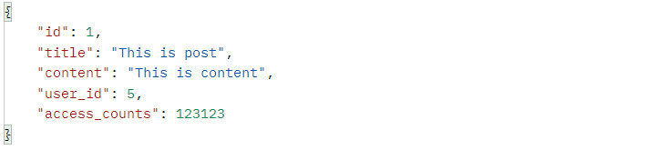

클라이언트에게 API 요청이 오면 서버에서는 JSON으로 응답한다. 보통 dto를 사용하여 클라이언트에게 응답하는데, 기본적으로 dto의 필드 이름과 JSON의 Attribute 이름은 동일하다.

<p align=middle>
    
</p>
<p align=middle>
    
</p>

JSON의 Attribute 이름을 바꿀 수도 있는데, 이때 `@JsonProperty`, `@JsonNaming` 어노테이션을 사용할 수도 있고 SpringBoot를 사용할 경우 application.yml에 글로벌하게 설정할 수도 있다.

## @JsonProperty
`@JsonProperty` 어노테이션을 사용하면 각 필드에 개별적으로 Attribute 이름을 설정할 수 있다.

<p align=middle>
    
</p>
<p align=middle>
    
</p>

그런데 만약 JSON Attribute 이름을 자바의 네이밍 컨벤션과 동일하게 카멜 케이스로 하다가 중간에 스네이크 케이스로 변경된다면, dto가 하나만 존재하는 것도 아니며 각 dto에 필드도 무수히 존재한다.  @JsonProperty를 필드마다 사용하게 되면 매우 번거로운데, 이때 @JsonNaming을 사용하면 된다.

## @JsonNaming
`@JsonNaming` 어노테이션을 클래스 레벨에 달아주고 네이밍 전략을 선택하면 필드에 일일이 @JsonProperty를 사용하지 않고도 JSON Attribute 이름을 수정할 수 있다.

<p align=middle>
    
</p>
<p align=middle>
    
</p>

만약 dto 필드의 이름과 응답할 JSON Attribute의 이름이 완전히 다를 경우에는 `@JsonNaming`만으로는 해결할 수 없는데, 이때는 `@JsonProperty`와 함께 사용하면 된다.

<p align=middle>
    
</p>
<p align=middle>
    
</p>

`PropertyNamingStrategies`에는 다양한 네이밍 전략들이 정의 되어있으니 상황에 맞게 잘 사용하면 된다.


```java
public static final PropertyNamingStrategy LOWER_CAMEL_CASE = new LowerCamelCaseStrategy();

public static final PropertyNamingStrategy UPPER_CAMEL_CASE = new UpperCamelCaseStrategy();

public static final PropertyNamingStrategy SNAKE_CASE = new SnakeCaseStrategy();

public static final PropertyNamingStrategy LOWER_CASE = new LowerCaseStrategy();

public static final PropertyNamingStrategy KEBAB_CASE = new KebabCaseStrategy();

public static final PropertyNamingStrategy LOWER_DOT_CASE = new LowerDotCaseStrategy();
```

주의 해야하는 것은 `PropertyNamingStrategy`라는 단수 이름을 가진 클래스도 있는데 해당 클래스는 데드락 문제 때문에 Deprecated 되었다.(자세한 내용은 [여기](https://github.com/FasterXML/jackson-databind/issues/2715)를 참고).


## application.yml 설정
스프링부트를 사용할 경우 application.yml(properties)에서 Jackson의 property-naming-strategy를 설정할 수도 있다.

<p align=middle>
    
</p>
<p align=middle>
    
</p>
<p align=middle>
    
</p>
